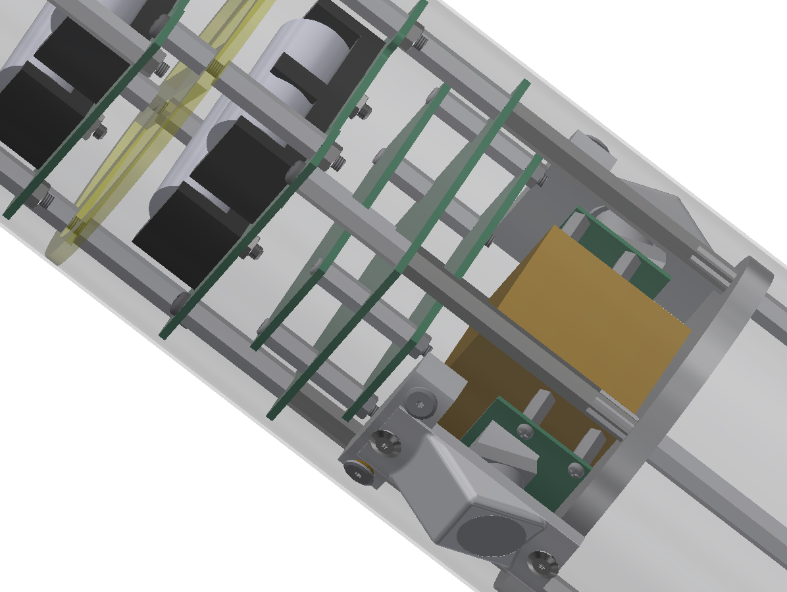

# C-61J カメラ基板 仕様書

# 概要
このシステムは以下から構成される。
 - raspberry pi camera (以下camera) *2
 - raspberry pi zero (以下raspi) *2
 - 制御・データロガー基板 (以下ESP32) *1

cameraとraspiはそれぞれフレキシブルケーブルによって接続される。
また、raspiはESP32によって電源、および録画の制御が行われる。

# ESP32について
## ESP32の役割
 - 1kHzのデータレートで加速度・角速度センサ `MPU9250`からデータを取得し、SPIflashに保存する。
 - 50Hzのデータレートで気圧センサ `LPS22HB`からデータを取得し、SPIflashに保存する。
 - 無線通信用に別途搭載する基板(以下無線基板)と通信を行う
 - raspiの電源制御と通信を行い、raspiに録画を実行させる
 - 昇圧回路とブザーを制御し、大音量を鳴らす

## 無線基板との通信
無線基板とは 115200 Hzのuartを用いて通信される。以下に挙動を示す
| 受信時 | 挙動                                                                                                                                                                                                       |
| ------ | ---------------------------------------------------------------------------------------------------------------------------------------------------------------------------------------------------------- |
| `'i'`  | `MPU9250`、 `LPS22HB`、raspiの正常性を確認、約 31 秒後に全てが正常ならば`'i'`を、1つでも以上があるならば`'o'`を返す。（追記:`LPS22HB`が故障のため、現在のプログラムは`LPS22HB`のチェックをパスするよう変更） |
| `'l'`  | すでにロギングが立ち上がっているならば、なにもしない。そうでない場合、`'l'`を返し、raspiの電源を投入、raspiの録画を開始、ロギングを開始                                            |
| `'s'`  | ロギングが起動していない場合、なにもしない。そうでない場合、`'s'`を返し、ロギングを終了、raspiの録画を停止、raspiの電源を解放                                                                              |
| `'d'`  | SPIflashのデータを削除し次第、`'d'`を返す                                                                                                                                                                                                |
| `'b'`  | `'b'`を返し、ブザー起動                                                                                                                                                                                    |
| `'u'`  | `'u'`を返し、ブザー停止                                                                                                                                                                                    |

また、SPIflashが埋まった際は、自動的にロギングと録画を終了する。

## LEDの挙動
以下にLEDの挙動を示す。
| 状態                       | LEDの点滅速度 |
|:-------------------------- | ------------- |
| ロギングを行っていないとき | 1 Hz          |
| ロギング準備中             | 20 Hz          |
| ロギング中                 | 10 Hz          |
| ロギング終了処理中                 | 5 Hz          |

## 記録フォーマット
SPIflashに以下のフォーマットで連続的に記録する。

| header      | timestamp | pressure data |
| ----------- | --------- | ------------- |
| 1 byte (0xE3) | 4 byte     | 3 byte         |

| header      | timestamp | acc gyro data |
| ----------- | --------- | ------------- |
| 1 byte (0xE0) | 4 byte     | 12 byte        |

## カメラを接続しなかった場合の挙動
raspiが即時シャットダウンするため`'i'`コマンドが失敗する。また、`'l'`コマンドについては録画は行われない。

# 参考画像

実際に組み立てられた基板

気体側面から見たカメラ